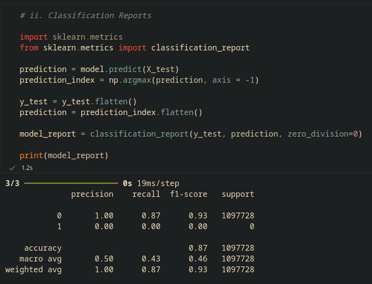

# Project : Identification of Cell Nuclei by Semantic Segmentation

### Introduction:
AI models using semantic segmentation can identify cell nuclei by classifying each pixel in an image as either part of a nucleus or background. The model is trained to detect features like shape, texture, and color that distinguish nuclei from surrounding tissue. This allows for precise delineation of nuclear boundaries, enabling automated, high-accuracy analysis of cell structures. Semantic segmentation is particularly useful in research and diagnostics for tasks like counting nuclei or measuring size, reducing manual effort and error while handling variations in tissue types or image quality.

### Dataset:
In this project, the dataset used was based on 2018 Data Science Bowl from Kaggle website (For more detail: https://www.kaggle.com/competitions/data-science-bowl-2018/overview ).

### Instruction:
In this repo, I already created the machine learning model in Jupyter notebook file format with a Python programming language (.ipynb). You can download it alongside with the dataset zip from the Kaggle website (required) in the same directory for it load the dataset for the categorization.

Open the .ipynb file in Microsoft Visual Studio Code (recommended).

Before running it, make sure you have installed a list of required Python packages through pip install as shown below:

```bash
pip install tensorflow tensorflow_examples scikit-image scikit-learn matplotlib numpy
```

### Model Architecture:


The model developed based on U-Net.

The U-Net is a deep learning model used for semantic segmentation, designed to identify cell nuclei by learning spatial features from images. Its encoder-decoder architecture captures high-level context and fine details, enabling accurate delineation of nuclei boundaries. U-Net’s ability to handle limited data and produce precise pixel-wise segmentation makes it ideal for cell nucleus identification in biomedical images.

### Results:

- Classification Report:



Note that, the accuracy of the model is almost 90%. This means the model could conduct the identification by semantic segmentation very well.

- Epoch Accuracy (Train versus Validation):


Before the model has been test for the identification, it must be trained first. As you can see, the trained model could achieved over 90 percent accuracy. In addition, the gap between train and validation run at last epoch is small, meaning the model is still in a good fit due to the U-Net Model Architecture.

- Epoch Loss (Train versus Validation):


As the accuracy has become better, the loss has decreased. Furthermore, the U-Net Model Architecture has helped to shrink the gap between the train and the validation to ensure the model in the good fit.

- Results of predicted segmented of cell nuclei:


